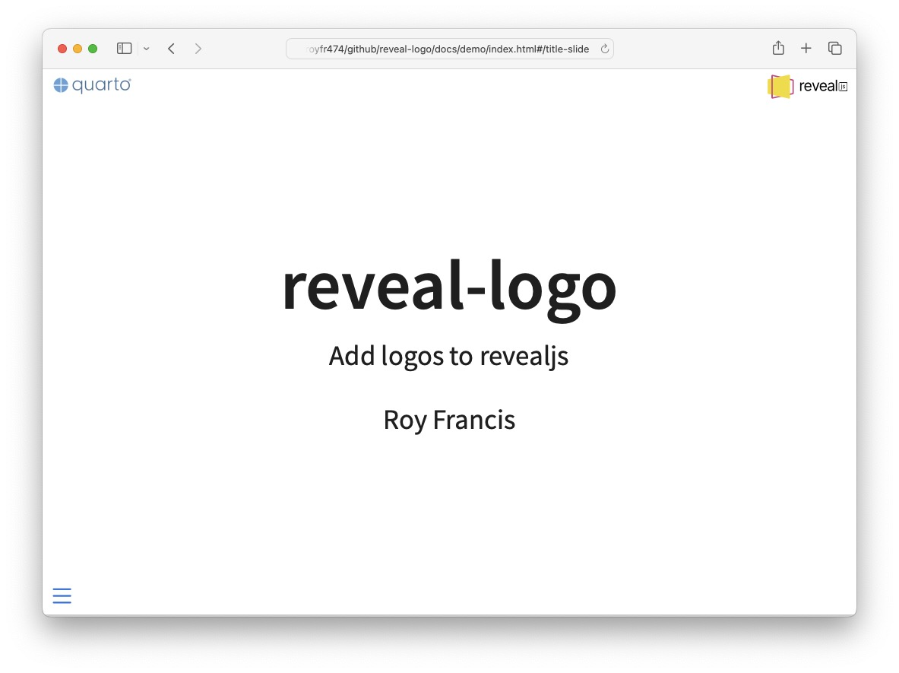

# reveal-logo

A quarto extension to add logos to revealjs presentation



- Add one or two logos on the top
- Add a URL as a clickable link
- Adjust height of logos

## Install

- Requires Quarto >=1.2.0
- Install extension to the root of the project 
- Run in the terminal

```
quarto add royfrancis/reveal-logo
```

## Usage

- Add to filters in yaml metadata

```yaml
filters:
  - reveal-logo
```

- Add parameters to `format: revealjs`.

|Parameter|Description|
|---|---|
|`header-logo-left`|Add a logo to top left|
|`header-logo-right`|Add a logo to top right|
|`header-logo-left-height`|Height of left logo in css units|
|`header-logo-right-height`|Height of right logo in css units|
|`header-logo-left-url`|Add a clickable link to the left logo|
|`header-logo-right-url`|Add a clickable link to the right logo|

For more information, click [here](https://royfrancis.github.io/reveal-logo).

## Acknowledgements

- [Quarto](https://quarto.org)
- [shafayetShafee/reveal-header](https://github.com/shafayetShafee/reveal-header)

---

2024 | Roy Francis
